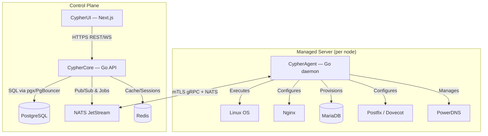

# CypherPanel — Architecture

> Technical reference: system layout, data flow, tech stack, and repo structure. For *what* and *why* see [PRD.md](PRD.md); for coding boundaries see [Rules.md](Rules.md); full original rationale lives in [plan.md](plan.md) (treat this file as the navigable summary of it — `plan.md` is still the source of truth for edge cases).

## 1. System Overview

Three cooperating layers:



- **CypherCore** never touches a managed server's OS directly — it only talks to CypherAgent over mTLS gRPC (control calls: Register/Heartbeat/ReportTaskResult) and dispatches work through NATS JetStream (durable, per-server task subjects).
- **CypherAgent** runs as root on the managed server, but treats every incoming task as untrusted input requiring validation — it is the only thing that ever shells out to the OS.
- **CypherUI** never talks to Postgres/Redis/NATS directly — everything goes through CypherCore's REST API (proxied same-origin via Next.js rewrites, so there is no CORS setup).

## 2. Request/Task Flow (example: "create a database")

1. Browser → `POST /api/v1/.../databases` on CypherUI → proxied to CypherCore.
2. CypherCore's auth middleware validates the JWT, resolves role + resource scope (reseller/account ownership) through the centralized policy layer.
3. Core writes the intent to Postgres and enqueues a task on the target server's NATS subject (idempotent, retryable, dead-letters after max attempts).
4. The account's CypherAgent picks up the task, runs the MariaDB provisioning logic, reports the result back over gRPC (`ReportTaskResult`).
5. Core persists the result, writes an audit-log row (actor, target, timestamp — mandatory for any provisioning/suspension/permission-changing action), and the UI reflects the new state via polling/WebSocket.

Synchronous vs. event-driven boundary: anything that must succeed-or-fail before the HTTP response returns (e.g., creating the Linux user during account creation) is a **direct call**, never routed through the event bus. The event bus (`events.>` NATS subjects, separate from agent-task subjects) is for decoupled reactions only — notifications, audit-adjacent side effects, webhooks, future plugins.

## 3. Technology Stack

### Backend control plane
- **Go** (latest stable) — Gin for REST (not Fiber — fasthttp breaks net/http middleware compatibility and the performance delta doesn't matter at the API layer)
- **gRPC + mTLS** for Core↔Agent
- **pgx + sqlx**, hand-written SQL — **no GORM** (reflection/eager-loading cost too much at millions-of-rows scale)
- **PgBouncer** (transaction pooling) in front of PostgreSQL — required once Core runs multiple stateless replicas

### Frontend
- **Next.js** (App Router, `output: "standalone"`), React
- **Tailwind CSS** + **shadcn/ui** (Radix primitives, copied into the repo — not a vendored dependency, so theming/white-labeling never fights external CSS)
- **TanStack Query** for server-state/caching
- **Lucide React** icons

### Data & messaging
- **PostgreSQL** (users, servers, packages, accounts, task/audit history) — plan for read replicas + partitioning/Citus on the largest tables as scale grows
- **Redis** — auth sessions/refresh tokens, rate limiting, short-term cache
- **NATS JetStream** — task queue and event bus (chosen over RabbitMQ: single small Go static binary, far lower idle RAM than an Erlang/OTP broker)
- **Prometheus/VictoriaMetrics** — all time-series metrics; **never** high-cardinality metrics in Postgres

### Daemon & OS integration
- **systemd** service/slice management; **cgroups v2** for per-account CPU/memory/IO limits
- **Lego** (Go ACME client) for Let's Encrypt/ZeroSSL issuance
- Config generation via Go's `text/template`, validated then reloaded (e.g. `nginx -t` before reload — never a blind restart)

### API contracts
- **OpenAPI 3.1**, generated from Go handler annotations (swaggo) — spec is generated, never hand-maintained; served at `GET /api/v1/openapi.json`
- CypherUI's TypeScript client is generated from that spec (`npm run gen:api` → `web/lib/api-types.ts`) — no hand-written endpoint shapes
- `.proto` files under `proto/` are the source of truth for the Core↔Agent gRPC contract — append-only (never reuse/renumber a shipped field), since Core/Agent versions skew during rolling upgrades
- `golang-migrate` for schema changes — paired up/down migrations, checked into `migrations/`, never hand-edited once shipped

## 4. Repository Layout

Single monorepo (kept together while Core/Agent/UI contracts are still moving; split later only if release cadences genuinely diverge):

```
cmd/
  core/                 CypherCore entrypoint (Gin server, REST /api/v1, gRPC :9090)
  agent/                CypherAgent entrypoint (per-server daemon)
internal/               Shared Go packages — see below
proto/agent/            gRPC contracts (.proto, source of truth) + buf config
migrations/             PostgreSQL schema migrations (golang-migrate, .up.sql/.down.sql pairs)
gen/                    Generated code (buf/gRPC stubs) — never hand-edited
web/                    CypherUI — Next.js app
  app/(shell)/           Authenticated dashboard routes
  app/login/             Auth screens
  components/ui/         shadcn/ui components (copied in, themed via tokens)
  lib/                   Typed API client + generated api-types.ts
.claude/skills/         Project-specific AI/contributor conventions (one skill per subsystem)
docs/                   Compatibility matrix, generated OpenAPI/swagger output
scripts/                Installer/dev tooling
bin/                    Build output (gitignored)
Website-references/     Cloned competitor panels for UX/architecture research only — gitignored, not part of the product
```

Key `internal/` packages (each has a paired `.claude/skills/` entry — read it before touching the area): `acme`, `agentrpc`, `api`, `audit`, `auth`, `config`, `cron`, `dns`, `events`, `filemanager`, `ftp`, `hoststats`, `jobs`, `mailstore`, `paths`, `phpini`, `phpruntime`, `pki`, `platform`, `plugins`, `secretcrypt`, `services`, `sslrenew`, `store`, `terminal`, `usersdb`, `version`, `webserver`.

## 5. Portability Rules (why the layout looks like this)

The product runs on Linux servers only, but the codebase must build/test on Windows/macOS/Linux dev machines:

- **No hardcoded filesystem paths anywhere.** Every path goes through `internal/paths` (per-distro layout mapping: Debian vs. RHEL-family locations differ for vhosts, PHP-FPM pools, systemd units) or `filepath.Join` — never string-concatenated literals.
- **Linux-only code lives behind interfaces**, real implementation in `_linux.go` build-tagged files (`internal/platform`). Business logic, config templates, API handlers, and job orchestration stay platform-neutral and unit-testable without Linux.
- **`CGO_ENABLED=0`** everywhere so cross-compilation (`GOOS=linux GOARCH=amd64|arm64`) never breaks.
- Dev stack is `docker-compose` (Postgres/Redis/NATS + a Linux container for agent E2E), runnable identically on any host OS.

## 6. Scalability Path

Design targets (see `plan.md` §8 for the full table): ~50k accounts / 200 agent nodes for the Phase 1-2 MVP, architected to not require a rewrite to reach 1M+ accounts / 10k+ nodes later.

- CypherCore is fully stateless (sessions in Redis, not memory) — scales horizontally behind a load balancer, no sticky sessions
- Single Postgres primary + PgBouncer now; read replicas and Citus/partitioning are the planned next step for the largest tables, not a later redesign
- NATS subject partitioning per-server/region once fleet size demands it
- Every agent-directed task is idempotent and retryable — required at scale, not an edge-case nicety

## 7. Security & Isolation Model

- Every hosted account is a dedicated Linux system user
- Every account gets its own PHP-FPM pool/socket
- cgroups v2 slices enforce CPU/memory/IO per account
- Shell access (where granted) is jailed (`jailkit`/chroot or namespace-based sandboxing)
- Core↔Agent traffic is always mTLS

Auth model (JWT + Redis refresh tokens, Argon2id, 3 MVP roles, centralized policy middleware, mandatory audit trail) is detailed in `plan.md` §6 and enforced per [Rules.md](Rules.md).

## 8. Current Build Status

See [Memory.md](Memory.md) for the live progress snapshot, and `task.md` for the granular per-item checklist.
