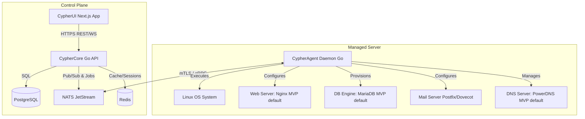

# CypherPanel: Open-Source cPanel & WHM Alternative

CypherPanel is a modern, secure, and self-hosted control panel designed to be a direct, feature-complete replacement for cPanel and WHM. It provides a modular, API-first architecture designed for shared hosting providers, VPS administrators, agencies, and web developers.

---

## 1. Project Vision & Philosophy

*   **API-First Design:** Every feature in the UI must be powered by a fully documented, RESTful or gRPC API.
*   **Modular Architecture:** Components (e.g., DNS, mail, database servers) are decoupled, allowing administrators to swap out services (e.g., swap BIND for PowerDNS, or Nginx for OpenLiteSpeed).
*   **Host Isolation:** Ensure strict security and resource control using modern Linux capabilities, systemd cgroups, and isolated PHP-FPM pools.
*   **Ease of Installation:** A single-command shell installer that automatically provisions the core system, configures repositories, and bootstraps the panel.
*   **Distro Agnostic:** Native support for major Linux distributions, focusing on Enterprise Linux (Rocky Linux, AlmaLinux) and Debian/Ubuntu systems.

---

## 2. High-Level Architecture

CypherPanel is divided into three distinct layers:
1.  **CypherCore (Central Controller):** The management plane, running the central API, scheduler, database, and message queue.
2.  **CypherUI (Admin & User Frontends):** Next.js UIs communicating with CypherCore.
3.  **CypherAgent (Server Daemon):** A lightweight service running on each managed server that executes local operations (creating virtual hosts, databases, system accounts, etc.).

> **MVP Default Stack:** The modular architecture is a target end-state, not a Phase 1 requirement. Building config generators for every listed alternative (Nginx *and* Apache *and* OpenLiteSpeed; BIND9 *and* PowerDNS; PostgreSQL *and* MariaDB for user databases) in parallel will stall the roadmap. MVP ships against **one default per category**, with the others implemented later as swappable adapters behind the same internal interface:
> *   **Web server:** Nginx (widest compatibility, lightest resource footprint, best PHP-FPM socket support).
> *   **DNS server:** PowerDNS (REST API-driven zone management fits an automation-first control plane far better than hand-editing BIND zone files).
> *   **User databases:** MariaDB (the default the vast majority of shared-hosting PHP applications — WordPress, etc. — actually expect). PostgreSQL support for user databases ships as a post-MVP adapter, not simultaneously.
> *   **Mail:** Postfix + Dovecot (already singular — no change needed).



---

## 3. Technology Stack

> **Version Policy:** Version numbers in this document are not pins — treat every one as "latest stable as of the last time this plan was checked," last verified **2026-07-14**. Before scaffolding each component (and again at the start of each roadmap phase, since phases may span months), search online for the current latest stable release of that language/framework/server/database (or current LTS, where the project publishes one) as of the date you're actually building it, and use that instead of any version written here. Never deliberately build against an older release when a newer stable one is available — the only exception is a documented compatibility blocker (e.g., a required library not yet updated for a new major version), which should be noted inline where it applies.

### Backend Control Plane
*   **Programming Language:** Go (latest stable release — check the official Go release page at implementation time) for its speed, safety, static binaries, and system-level performance.
*   **API Framework:** Gin (net/http-compatible, mature middleware ecosystem, predictable memory behavior under load). Avoid Fiber for the control plane — its fasthttp base breaks net/http middleware/library compatibility and complicates HTTP/2 and streaming support; the performance delta over Gin does not matter at the API layer, where the database and message queue are the real bottlenecks.
*   **RPC Framework:** gRPC with mTLS for secure and fast communications between CypherCore and CypherAgent.
*   **ORM / Database Driver:** `pgx` + `sqlx` only. Do **not** use GORM for hot paths — its reflection-based mapping and default eager-loading behavior cause N+1 queries and materially higher CPU/RAM per request at scale. Hand-written SQL via `sqlx`/`pgx` keeps query plans predictable, which matters once tables (accounts, domains, DNS records) reach millions of rows.
*   **Connection Pooling:** PgBouncer in transaction-pooling mode in front of PostgreSQL. Go's own pgx pool is per-process; without PgBouncer, horizontally-scaled CypherCore replicas will each open their own pool and exhaust Postgres `max_connections` long before you reach millions of accounts.

### Frontend
*   **Framework:** Next.js (App Router, latest stable release — check current version at implementation time) with React, deployed in `output: "standalone"` mode. Keep pages that don't need SSR (static docs, marketing) statically generated; reserve SSR for pages that genuinely need per-request data, since each SSR request holds a Node.js worker — at scale this is the more expensive part of the control plane, not the Go API.
*   **Styling:** Tailwind CSS or Vanilla CSS for premium, responsive layouts.
*   **State & Data Fetching:** React Query (TanStack Query) for cached server-state management.
*   **Icons & Assets:** Lucide React for consistent vector symbols.

### Data & Messaging
*   **Database:** PostgreSQL (stores users, server info, packages, metadata, and task history), fronted by PgBouncer. Plan for read replicas once reporting/dashboard queries start competing with provisioning writes.
*   **Caching & Sessions:** Redis (user authentication sessions, API rate-limiting, and short-term cache).
*   **Task Queue:** NATS with JetStream. Prefer this over RabbitMQ as the default: NATS is a single small Go static binary with a low idle memory footprint, whereas RabbitMQ runs on the Erlang/OTP VM and carries meaningfully more baseline RAM overhead per broker node — the opposite of the "use less resources" goal. Keep RabbitMQ only as a documented alternative for operators who already run it, not the default install path.

### Daemon & OS Integrations
*   **Service Manager:** Systemd (creating custom user services, setting limits, and starting/stopping services).
*   **SSL Engine:** Lego (Go-based Let's Encrypt / ACME client library).
*   **Process Isolation:** systemd-run with control groups (cgroups v2) to enforce CPU, memory, and IO limits per user pool.

### Portability & Development Environment

The product targets Linux servers (that's where CypherAgent runs), but the *codebase* must be developable and buildable from any OS — contributors will be on Windows, macOS, and Linux, and an open-source project that only builds on one platform loses contributors at the door.

*   **No hardcoded paths — anywhere.** Every filesystem path is either (a) constructed with `filepath.Join` (never string concatenation with `/`), or (b) loaded from a single central config/defaults package — never scattered as string literals through feature code. This is not only a Windows-dev concern: paths differ *between Linux distros* too (Nginx vhosts: `/etc/nginx/sites-enabled` on Debian/Ubuntu vs `/etc/nginx/conf.d` on RHEL-family; PHP-FPM pools, systemd unit dirs, and web roots all vary). CypherAgent resolves all system paths through a per-distro path-mapping layer with config-file overrides, giving distro-agnostic support and operator customization from the same mechanism.
*   **Cross-compilation as the build model:** Go cross-compiles trivially (`GOOS=linux GOARCH=amd64 go build`, plus `arm64` for the growing ARM VPS market). Developing on Windows and producing Linux binaries is a one-flag operation; `CGO_ENABLED=0` everywhere so this never breaks. The Next.js UI is platform-agnostic already.
*   **Linux-dependent code behind interfaces:** Everything that only exists on Linux (systemd calls, cgroup writes, `/etc/passwd` user creation, PAM) lives behind Go interfaces with the real implementation in `_linux.go` build-tagged files. Business logic, config generation (`text/template` output), API handlers, and job orchestration stay platform-neutral and unit-testable on any dev machine — only the thin syscall layer needs Linux.
*   **Dev environment:** `docker-compose` dev stack (PostgreSQL, Redis, NATS, and a Linux container for agent integration tests) as the canonical way to run CypherPanel locally on any OS — on Windows this runs via Docker Desktop/WSL2. CypherCore and the UI run natively anywhere; full CypherAgent E2E tests run in the container/WSL2 or CI.
*   **Repo hygiene for cross-OS contributors:** `.gitattributes` enforcing LF line endings on all shell scripts, configs, and templates (a CRLF shell script silently breaks on servers — the classic Windows-contributor trap); `.editorconfig` for consistent formatting; CI builds and tests on Linux so the target platform is always the source of truth, regardless of what OS the code was written on.

### API Contract & Repository Strategy
*   **REST Contract:** OpenAPI 3.1 spec for the CypherCore REST API, generated from Go handler annotations (e.g., `swaggo` or `huma`) rather than hand-maintained separately — a spec that drifts from the implementation is worse than no spec. All routes versioned under `/api/v1/...` from day one so breaking changes later don't require a new domain/port.
*   **Frontend Client Generation:** Generate the CypherUI's TypeScript API client from the OpenAPI spec (e.g., `openapi-typescript`) instead of hand-writing fetch calls — keeps frontend and backend from silently drifting apart as the API grows.
*   **CypherCore ↔ CypherAgent Contract:** `.proto` files are the source of truth for the gRPC interface, versioned in the same repo as both binaries. Never reuse or renumber a proto field once shipped — only add new optional fields — since Core and Agent versions will not always match exactly during rolling upgrades across a large agent fleet.
*   **Schema Migrations:** `golang-migrate` or `Atlas` for PostgreSQL schema changes, checked into the repo and applied as an explicit CI/deploy step — never hand-applied to a running database.
*   **Repository Layout:** A single monorepo (`cmd/core`, `cmd/agent`, `internal/...`, `web/` for the Next.js app) for MVP. This keeps CypherCore/CypherAgent/CypherUI versioned and released together while the contracts between them are still moving; split into separate repos later only if release cadences genuinely diverge.

---

## 4. Architectural Component Breakdown

### A. Admin Panel (WHM Equivalent)
The management dashboard used by hosting providers.
*   **Server Management:** Register, monitor, and configure nodes running CypherAgent.
*   **Package Management:** Define hosting templates with limits on:
    *   Disk space (inodes and MBs)
    *   Monthly bandwidth
    *   Number of domains (addon, subdomain, aliases)
    *   Number of databases and email accounts
    *   CPU, Memory, and Concurrent Connections (cgroup limits)
*   **Account Provisioning:** Provision, suspend, and terminate user accounts across servers.
*   **Reseller Management:** Allocate resource pools to resellers to allow them to create packages and provision user accounts.
*   **Global Service Control:** Monitor, stop, start, and configure global services (MVP: Nginx, Postfix, Dovecot, PowerDNS, MariaDB — extended to Apache/OpenLiteSpeed/BIND once those adapters ship post-MVP).
*   **SSL Certificates:** Global management of auto-renewing host certificates.
*   **DNS Clustering:** Setup primary/secondary DNS sync relationships across server nodes.
*   **Backup Policies:** Schedule automated system-wide and user-level backups to external endpoints (S3, SFTP, local paths), using incremental, deduplicated backups (restic or Borg) rather than repeated full tar/zip archives — at scale, full re-archiving of every account on every run is the single fastest way to blow past a "low resource usage" goal on both disk and CPU.

### B. User Panel (cPanel Equivalent)
The portal used by individual site owners to manage their hosting environments.
*   **Domain Management:**
    *   **Addon Domains:** Separate directory hosting.
    *   **Subdomains:** Virtual subdirectories.
    *   **Aliases/Parked Domains:** Map secondary domains to target sites.
    *   **Redirects:** Configure 301/302 redirects.
*   **DNS Zone Editor:** Complete control over A, AAAA, CNAME, MX, TXT, SRV, and CAA records.
*   **File Management:**
    *   A responsive, modern web-based File Manager (drag-and-drop, upload/download, ZIP/UNZIP, inline code editor).
    *   FTP Accounts management (Pure-FTPd virtual users — MVP default; ProFTPD adapter post-MVP).
*   **Database Management:**
    *   Create MariaDB databases and users (MVP default; PostgreSQL user databases post-MVP).
    *   Assign user permissions to databases.
    *   One-click access to phpMyAdmin / Adminer.
*   **Email Management:**
    *   Create accounts, set mailbox quotas.
    *   Configure mail forwarders, autoresponders, and filters.
    *   Spam filters control (Rspamd management).
    *   SPF, DKIM, and DMARC config.
*   **Security & SSL:**
    *   One-click Let's Encrypt / ZeroSSL generator.
    *   Custom SSL/TLS certificate uploads.
    *   IP Blocker, Password Protected Directories, Hotlink Protection.
*   **Advanced Management:**
    *   **Cron Jobs:** Manage crontab entries with template shortcuts.
    *   **PHP Selector:** Choose PHP version per domain across all currently-supported PHP release branches (check php.net's supported-versions list at implementation time, since older branches referenced here may be EOL by launch) and edit parameters (memory_limit, upload_max_filesize) via a custom MultiPHP INI Editor. Still offer the last 1-2 EOL branches unmaintained/unpatched for legacy app compatibility, but clearly flag them as insecure in the UI.
    *   **Git Integration:** Deploy repositories directly from Github/Gitlab into public directories.
    *   **SSH Keys:** Import and generate keypairs for SSH access.
    *   **Terminal:** Secure, web-based terminal executing within the user's isolated shell context.

### C. Server Daemon (CypherAgent)
The Go-based daemon service running locally on every managed machine.
*   Runs with `root` privileges to handle OS configuration but implements strict verification for received commands.
*   **Task Executor:** Subscribes to NATS JetStream subjects to process events in the background.
*   **Config Generators:** Uses Go's `text/template` library to generate configurations for:
    *   Nginx virtual hosts (MVP default; Apache/OpenLiteSpeed adapters post-MVP)
    *   PowerDNS zone files (MVP default; BIND adapter post-MVP)
    *   Postfix / Dovecot mailboxes and domains
    *   PHP-FPM pool files
*   **Linux PAM Integration:** Handles creation of system users and configures permissions in `/home/{username}/`.
*   **SSL Issuance:** Automatically solves ACME challenges (HTTP-01 or DNS-01) using the Lego library, moving certificates to target paths and reloading web servers.
*   **Backups:** Local packagers running restic/Borg (incremental, deduplicated, chunk-level) plus db-dumps, writing to desired endpoints without locking the UI. Reserve raw tar/zip only for one-off manual export/download requests, not the scheduled backup path.

---

## 5. UI/UX Design Direction

For an open-source challenger, the UI is not cosmetic — it is the primary adoption lever. cPanel's dated, page-reload-heavy interface is one of its most common user complaints, and Plesk wins customers largely on looking cleaner. CypherUI must feel like a modern SaaS product (Vercel/Linear/Stripe-dashboard tier), not a themed legacy panel.

### Design System & Foundations
*   **Component Library:** shadcn/ui on top of Tailwind CSS and Radix UI primitives. This fits the already-chosen stack (Next.js + Tailwind + Lucide), gives accessible components out of the box, and — because shadcn components are copied into the repo rather than imported as a dependency — the design system is fully ownable and themeable without fighting a vendor's CSS.
*   **Theming:** Light and dark mode from day one (CSS variables / Tailwind theme tokens), respecting `prefers-color-scheme` with a manual toggle. Dark mode is table stakes for a developer-facing tool in this era, not a post-MVP nicety.
*   **White-Labeling:** Hosting providers and resellers must be able to rebrand the panel — logo, accent colors, product name, custom login-page domain — via config, not code forks. cPanel and Plesk both sell this; for CypherPanel it's a headline reason for an organization to adopt (their customers see *their* brand). Build the theme layer around design tokens from the start so this is a config file, not a refactor.
*   **Accessibility:** WCAG 2.1 AA as the bar — full keyboard navigability, visible focus states, correct ARIA on all interactive components (Radix primitives cover most of this), and color-contrast-safe palettes in both themes. Organizations (especially government/education hosts) increasingly require this in procurement.
*   **Internationalization:** i18n scaffolding (e.g., `next-intl`) from the first screen, even if MVP ships English-only. Hosting is a global market, retrofitting i18n across hundreds of screens is brutal, and community translations are one of the easiest ways for an open-source project to gain international contributors and users.

### Application Shell & Navigation
*   **Layout:** Persistent left sidebar (collapsible, grouped by domain area: Domains, Files, Databases, Email, Security, Advanced) + breadcrumbs — replacing cPanel's icon-grid homepage, which forces a full page navigation for every action.
*   **Command Palette:** Ctrl/Cmd+K fuzzy search across every feature, domain, database, and email account ("pma" → phpMyAdmin for db X, "ssl example.com" → cert manager). This single feature does more to make a panel feel modern than any visual styling, and it doubles as the answer to "cPanel has 100 features and I can't find any of them."
*   **Separate Admin and User shells:** WHM-equivalent (fleet/servers/packages/resellers) and cPanel-equivalent (one account's hosting) are distinct apps with distinct navigation — sharing the design system and component library, not the layout. Admins managing 200 nodes and end users managing one WordPress site have opposite information-density needs.

### Interaction Patterns
*   **No full-page reloads:** All mutations through React Query with optimistic updates where safe (DNS record edits, cron toggles) and pending states where not (account provisioning).
*   **Async job transparency:** Long-running operations (provisioning, backups, SSL issuance) already flow through the NATS job pipeline — surface them in a persistent notification center with live progress and success/failure states, streamed over WebSocket/SSE. Never leave the user staring at a spinner wondering if the backup started; this is a direct UX win over cPanel's fire-and-hope forms.
*   **Live resource meters:** Dashboard cards for disk/bandwidth/inode/CPU usage against package limits, fed from the metrics store — visible at a glance on login, since "am I near my limit?" is the single most common reason end users log into a panel.
*   **Empty states & first-run onboarding:** Every list screen designed empty-first (clear call-to-action, one-line explanation), plus a guided first-run wizard (add server → create package → create first account) for the admin shell. Open-source tools live or die on the first 10 minutes after `curl | bash`.
*   **Destructive-action safety:** Type-to-confirm for irreversible operations (terminate account, delete database, delete domain) — never a bare "Are you sure?" modal.

### Performance Budget (UI)
*   The panel must feel fast on the cheap VPSes it will actually run on: per-route code splitting (the File Manager's editor bundle must not load on the DNS page), initial route JS kept lean, virtualized tables for large lists (10k DNS records, 50k accounts in admin), and skeleton loaders over spinners. A "lightweight panel" claim is judged by UI responsiveness as much as by daemon RSS.

---

## 6. Authentication & Access Control Model

This is foundational plumbing that every feature in Section 4 sits on top of — it must be designed before Phase 1, not deferred to Phase 6 hardening.

*   **Token Model:** Short-lived JWT access tokens (~15 min) for API requests, plus a refresh token stored server-side in Redis (so it can be revoked immediately on logout/suspension — a pure stateless JWT can't be revoked before expiry). Access tokens keep the API stateless and horizontally scalable; the revocable refresh token closes the "can't kill a session" gap that comes with pure JWT.
*   **Password Storage:** Argon2id for all human-user passwords. Note this is distinct from the mTLS certificates used for CypherCore ↔ CypherAgent auth — those secure machine-to-machine traffic, not user logins, and use their own cert lifecycle.
*   **Role Model (MVP):**
    *   **Root Admin** — full WHM-equivalent control: server registration, global service control, all packages/resellers/accounts.
    *   **Reseller** — scoped to a resource pool allocated by a Root Admin; can create packages and provision/suspend/terminate accounts only within that pool.
    *   **End User** — scoped to their own single hosting account (cPanel-equivalent); no visibility into other accounts, packages, or server internals.
    *   (Post-MVP: sub-roles for team/developer collaboration per `upcoming-features.md` §6, layered on top of the End User role rather than replacing this model.)
*   **Authorization Enforcement:** Every JWT claim carries role plus the specific resource IDs the caller is scoped to (e.g., `reseller_id`, `account_id`). Authorization checks must live in a single centralized middleware/policy layer that resolves "does this caller own/have grant to this resource," not ad-hoc `if role == admin` checks scattered per handler — scattered checks are exactly where IDOR-style bugs (a reseller reading another reseller's accounts by guessing an ID) slip through at this scale.
*   **Audit Trail:** Every provisioning/suspension/permission-changing action logged with actor identity, target resource, and timestamp from Phase 1 — this can't be bolted on later without losing history, and Section 4A's reseller/account management is exactly the kind of privileged action surface that needs it from day one.

---

## 7. Security & Isolation Model

To provide safe shared hosting, CypherPanel adopts the following isolation standards:

*   **Dedicated System Users:** Every hosted account runs under its own Linux user (e.g., `cyph_user12`). Direct ownership of public directories prevents directory traversal vulnerabilities.
*   **PHP-FPM Pool Isolation:** A dedicated PHP-FPM socket (e.g., `/var/run/php/cyph_user12.sock`) is generated for each user account. Web servers pass PHP requests exclusively through this socket.
*   **cgroups v2 Sandboxing:** Systemd slices are configured for each account, enforcing limits directly in the kernel:
    ```ini
    # Example slice configuration
    [Slice]
    CPUQuota=100%
    MemoryMax=1G
    IOReadBandwidthMax=/dev/sda 10M
    ```
*   **Restricted Shell Access:** Users given shell access are mapped to custom environments or isolated using chroot/jail shells like `jailkit` or systemd-based sandboxing, preventing raw access to global system binaries.
*   **mTLS Communication:** CypherCore communicates with CypherAgents using mutual TLS (mTLS) to prevent spoofing or unauthorized controller access.

---

## 8. Scalability & Resource Efficiency Strategy

cPanel/WHM's reputation for heavy RAM usage largely comes from per-account cPanel daemons, `cpsrvd`, and legacy Perl processes running persistently even when idle. CypherPanel avoids this by design, but hitting "millions of accounts" scale and staying lighter than cPanel requires explicit targets, not just a lightweight language choice.

### Target Design Numbers (initial — revisit after Phase 2 load testing)

"Millions of users" isn't itself a design input; these are placeholder numbers to design against so Phase 1 architecture decisions (pooling, indexing, queue topology) have a concrete target instead of an abstract one. Adjust once real usage data exists:

| Metric | Phase 1-2 target (single-region MVP) | Long-term target (design must not preclude this) |
|---|---|---|
| Hosted accounts | ~50,000 | 1,000,000+ |
| CypherAgent nodes | ~200 | 10,000+ |
| CypherCore API nodes | 2-3 stateless replicas behind LB | N replicas, added without redesign |
| PostgreSQL topology | 1 primary + PgBouncer | Primary + read replicas + partitioning/Citus |
| Control-plane API latency | p95 < 200ms for CRUD ops | Same — must not degrade with account count |
| CypherAgent idle RSS | < 50MB | < 50MB (must not grow with accounts on that node) |

The important design rule this implies: nothing in Phase 1-2 should require a rewrite (not just a re-tune) to reach the long-term column — e.g., don't hardcode single-primary assumptions into query code that partitioning would later have to unwind.

*   **Stateless Control Plane:** CypherCore instances must hold no in-process session state (sessions live in Redis, not memory), so they can scale horizontally behind a load balancer with no sticky-session requirement.
*   **Database Scaling Path:** Single PostgreSQL primary + PgBouncer is sufficient for early scale. As account count grows, plan for (a) read replicas for reporting/dashboard queries, and (b) partitioning or the Citus extension for the largest tables (domains, DNS records, audit/task history) — do not defer this decision until the single primary is already the bottleneck.
*   **Time-Series Data Does Not Belong in Postgres:** Metrics (CPU/RAM/IO per account, bandwidth logs) should go to a purpose-built time-series store (Prometheus/VictoriaMetrics), not Postgres tables — this is both a performance and a resource-usage issue, since Postgres index bloat from high-cardinality metrics writes will drive up RAM/disk faster than anything else in the system.
*   **CypherAgent Memory Budget:** The per-server daemon should have an explicit idle RSS target (e.g. under ~30-50MB) and no per-hosted-account persistent process — it must react to gRPC/NATS events and generate configs on demand, not poll or keep long-lived state per user. This is the direct architectural answer to cPanel's per-account daemon overhead.
*   **Agent Fleet Communication at Scale:** With potentially thousands of CypherAgent nodes, use NATS subject partitioning per server/region rather than one global subject, and rely on JetStream clustering for message durability instead of a single broker instance.
*   **Idempotent, Retryable Jobs:** All agent-directed tasks (provisioning, SSL issuance, backups) must be idempotent with retry/dead-letter handling in the queue — at millions-of-accounts scale, some fraction of jobs will always fail transiently, and without idempotency this becomes a support burden, not just an edge case.

---

## 9. Implementation Roadmap

```
  Phase 1: Core Foundation & Agent Comms
  ├── docker-compose dev stack & cross-platform build setup (works from Windows/macOS/Linux dev machines)
  ├── Go backend scaffolding & API routing
  ├── Auth (JWT + refresh tokens), RBAC middleware & audit logging foundation (per Section 6)
  ├── Database schema migrations (PostgreSQL)
  ├── CypherAgent installation & gRPC/mTLS channel
  ├── User/Group creation & system daemon architecture
  └── Project agent skills (.claude/skills/) — write the Phase 1 batch of the full
      skills catalog (see "Project Agent Skills" below); every later phase ends by
      writing/updating its own batch

  Phase 2: Admin Plane & Provisioning
  ├── UI shell & design system foundation (shadcn/ui tokens, sidebar layout, auth screens,
  │   light/dark theming — per Section 5, so every later feature lands on finished foundations)
  ├── Server node registration
  ├── Package templating system
  ├── Account creation, suspension, and termination
  └── Automated Systemd service monitors

  Phase 3: Web Server & PHP Management
  ├── Virtual host config generators (Nginx MVP default; Apache/OpenLiteSpeed adapters deferred)
  ├── Multi-PHP installation scripts and PHP-FPM pool configs
  ├── PHP INI Editor API & user configuration files
  └── Lego ACME client integration (Let's Encrypt / ZeroSSL automation)

  Phase 4: Files, FTP, & Databases
  ├── Web File Manager (Next.js client + Go filesystem handler)
  ├── FTP Daemon configuration (Pure-FTPd virtual users)
  ├── Database provisioning APIs (MariaDB MVP default; PostgreSQL user-DB adapter deferred)
  └── phpMyAdmin and Adminer automatic setup/routing

  Phase 5: Email & DNS Servers
  ├── Postfix SMTP & Dovecot IMAP/POP3 configuration
  ├── Mail user authentication database & quotas
  ├── PowerDNS zones configuration (MVP default; BIND9 adapter deferred)
  └── DNS cluster synchronization engine

  Phase 6: Logging, Auditing, & Hardening
  ├── System metrics collecting (CPU, Memory, Disk IO)
  ├── User terminal and cron job managers
  ├── Audit log dashboards & retention policies (logging itself starts in Phase 1)
  └── Security hardening and release candidate packaging
```

> **Extensibility & Operability Additions (Sections 11-19):** these are architecture chapters, not new phases. Where a section's MVP-relevant piece is reserved rather than fully built: the plugin route/table reservation and Event Bus subject reservation (Sections 11-12) land in Phase 2 alongside the UI shell; the CLI/SDKs (Section 14), Webhooks (Section 15), and Metrics API (Section 16) land at the end of Phase 6 / post-MVP, once the OpenAPI spec, Event Bus, and metrics store they depend on are stable; the Upgrade & Migration Framework (Section 13) must exist before the first production update ships, i.e. as a Phase 6 release-candidate gate; Multi-Region (Section 17) and the Billing Integration Layer (Section 18) are post-MVP per `upcoming-features.md`; the Testing Strategy (Section 19) applies continuously from Phase 1 onward, not as a separate phase.

### Project Agent Skills (`.claude/skills/`) — Full Catalog

Following the pattern used by Coolify (which ships `.claude/skills/` with skills like `laravel-best-practices`, `pest-testing`, and `tailwindcss-development`), CypherPanel maintains its own project skills so that AI coding agents (Claude Code and compatible tools) working in this repo automatically follow its conventions instead of generic defaults. Each skill is a directory containing a `SKILL.md` (instructions + decision rules), optionally with `references/` files for templates and examples.

This is the catalog for the **entire project**. Timing rule: each skill is written **at the end of the phase that establishes its conventions** (a skill written before the pattern it describes exists in code is speculation, not guidance), so it is ready on day one of the phases that consume it. Skills are living documents — when a later phase extends a pattern, it updates the corresponding skill in the same PR (e.g., the post-MVP Apache adapter updates `agent-config-generators`).

#### Written at end of Phase 1 (used by every later phase)

1.  **`go-backend-conventions`** — How Go code is written in this repo: Gin handler/middleware structure, error-wrapping style, the central config/defaults package, the **no-hardcoded-paths rule** (`filepath.Join` or config only), `CGO_ENABLED=0`, and the `_linux.go` build-tag pattern that keeps Linux-only syscall code behind interfaces so everything else stays unit-testable on Windows/macOS.
2.  **`database-and-migrations`** — pgx/sqlx hand-written SQL patterns (explicitly: **no GORM**), query/scan conventions, how to create and apply `golang-migrate` migrations (paired `.up.sql`/`.down.sql`, never editing a shipped migration), and indexing expectations for tables that will reach millions of rows.
3.  **`grpc-proto-contracts`** — Rules for evolving the Core↔Agent `.proto` files: never reuse or renumber a shipped field, only add optional fields, regeneration workflow, and the mTLS/versioning assumptions that let mixed Core/Agent versions coexist during rolling upgrades.
4.  **`jobs-and-agent-tasks`** — How to add a NATS JetStream job type: subject naming/partitioning, the idempotency requirement (every task must be safely re-runnable), retry/dead-letter handling, and reporting results back through `ReportTaskResult`. Used by every phase that adds an agent-executed operation (provisioning, SSL, backups, mail, DNS).
5.  **`auth-and-rbac`** — How to secure a new endpoint: JWT claim structure, the centralized policy middleware (never ad-hoc `if role == admin` checks in handlers), resource-scoping rules (reseller/account ownership), and when an action must write to the audit trail (any provisioning/suspension/permission change).
6.  **`api-contract-workflow`** — Adding/changing a REST endpoint end to end: `/api/v1` versioning rules, OpenAPI annotations so the spec stays generated (never hand-edited), and regenerating the TypeScript client for CypherUI so frontend and backend cannot drift.
7.  **`testing-conventions`** — Table-driven Go tests, what runs natively on any dev OS vs. what requires the docker-compose stack or a Linux container (agent E2E), and the expectation that platform-neutral logic is tested without Linux.
8.  **`linux-system-integration`** — Creating system users/groups, systemd unit and slice management, cgroups v2 limit enforcement, and the per-distro path-mapping layer (Debian vs. RHEL-family locations) — the conventions established by Phase 1's user/group creation work and reused by every phase that touches the OS.

#### Written at end of Phase 2 (UI foundations + provisioning exist)

9.  **`ui-development`** — shadcn/ui component usage (copied into repo, themed via design tokens — never inline colors, so white-labeling stays a config file), Tailwind token conventions, light/dark theming, React Query data-fetching patterns (no raw `fetch` in components), Lucide icons, i18n string extraction (`next-intl` — no hardcoded UI strings), and the accessibility bar (WCAG 2.1 AA, keyboard nav, focus states). Consumed by every feature screen in Phases 3-6.
10. **`async-ui-patterns`** — How UI surfaces long-running jobs: wiring a mutation to the NATS job pipeline, live progress via WebSocket/SSE into the notification center, optimistic updates vs. pending states, empty-state and skeleton-loader conventions, and type-to-confirm for destructive actions.
11. **`extensibility-and-events`** — The plugin manifest schema and permission model (Section 11), the `/api/v1/plugins/` and `plugins` table reservation, Event Bus subject-naming conventions and the `events.>` vs. agent-task subject split (Section 12), and the rule for what stays a direct call vs. becomes an event. Consumed by every later phase that emits or reacts to a domain event.

#### Written at end of Phase 3 (config generation + SSL patterns exist)

12. **`agent-config-generators`** — Adding a service config generator: Go `text/template` conventions, template testing (golden files), resolving output paths through the distro path-mapping layer, validate-then-reload sequencing (e.g., `nginx -t` before reload, never blind restarts), and the adapter interface that post-MVP alternatives (Apache, OpenLiteSpeed, BIND) must implement. Consumed heavily by Phases 4-5 (FTP, mail, DNS configs).
13. **`php-runtime-management`** — Multi-PHP install layout, per-account PHP-FPM pool file conventions and socket isolation, INI override handling, and how EOL PHP branches are flagged.
14. **`ssl-acme`** — Lego library usage: HTTP-01 vs. DNS-01 challenge selection, certificate storage paths and permissions, renewal job scheduling, and web-server reload coordination after issuance.

#### Written at end of Phase 4 (file/database surfaces exist)

15. **`filesystem-operations-safety`** — The rules for any code that touches user files (File Manager, FTP, backups): path-traversal prevention (canonicalize + verify under the account root), operating with the account user's privileges (never root), quota/inode accounting, and safe handling of uploads, archives (zip-slip), and symlinks.
16. **`user-database-provisioning`** — MariaDB database/user/grant provisioning conventions, credential generation and storage, phpMyAdmin/Adminer session handoff, and the adapter interface PostgreSQL user-DBs will implement post-MVP.

#### Written at end of Phase 5 (mail + DNS stacks exist)

17. **`mail-stack`** — Postfix/Dovecot config conventions, virtual mailbox/domain layout, quota enforcement, Rspamd integration points, and DKIM/SPF/DMARC record generation.
18. **`dns-management`** — PowerDNS REST API usage patterns, zone/record CRUD conventions, validation rules per record type (A, AAAA, CNAME, MX, TXT, SRV, CAA), and primary/secondary cluster synchronization.

#### Written during Phase 6 (hardening & release)

19. **`observability-and-metrics`** — What goes to the time-series store (Prometheus/VictoriaMetrics) vs. Postgres (never high-cardinality metrics in Postgres), metric naming conventions, structured logging fields, audit-log query/retention patterns, and the Metrics API surface (Section 16).
20. **`backups`** — restic/Borg invocation conventions (incremental/deduplicated — raw tar only for one-off manual exports), endpoint configuration (S3/SFTP/local), db-dump coordination, and restore-path testing requirements.
21. **`installer-and-packaging`** — Shell installer conventions from Appendix A: GPG-verify every artifact, LF-only line endings, detect-and-ask (never silently purge conflicting services), no auto-reboot, release tiers (`stable`/`edge`), working uninstaller, and the 1GB-RAM install target.
22. **`upgrade-and-compatibility`** — The `cypherctl upgrade`/`rollback` workflow (Section 13): sequential migration replay rules, the mandatory pre-upgrade backup step, the compatibility-matrix format, and how Core/Agent/plugin version ranges are enforced at registration time.
23. **`public-interfaces`** — Conventions for everything built on top of the OpenAPI spec: generating the Go/Node/Python SDKs and `cypherctl` CLI commands (Section 14), the webhook signing/delivery/retry pattern (Section 15), and the billing-adapter contract (Section 18) — all treated as generated/thin layers over the existing REST surface, never hand-maintained parallel clients.

---

## 10. Licensing & Contribution

*   **License:** Apache-2.0 — pick one license, not "or MIT". Apache-2.0 is the better default for infrastructure software: it includes an explicit patent grant, which matters more here than for a typical app since hosting-provider adopters and contributors are more exposed to patent risk than end users.
*   **Governance:** Open-source project governed by community pull requests. All development occurs in public repositories, with dedicated tests and documentation.

---

## 11. Extensibility Architecture: Plugins, Extensions & Marketplace

Without this, third-party developers cannot extend CypherPanel without forking it — this is the single biggest structural gap in the plan as it stood, and the biggest lever for organic ecosystem growth once the MVP ships. MVP does **not** ship a plugin runtime or marketplace, but Phase 1-2 architecture must reserve the extension points now, since retrofitting a manifest/permission model after third parties have already built against an ad-hoc one is exactly the kind of breaking change Section 3's proto-versioning rules warn against.

*   **Plugin types:** Extensions (backend logic — subscribe to Event Bus events per Section 12, register API routes under `/api/v1/plugins/{id}/...`), UI Plugins (register sidebar entries, dashboard cards, or settings pages into the CypherUI shell), Themes (design-token overrides layered on the white-labeling system already planned in Section 5), Language Packs (i18n bundles on top of the `next-intl` scaffolding already planned in Section 5).
*   **Plugin manifest:** a `plugin.yaml` declaring name, version, the required CypherPanel core version range (semver — ties into Section 13's compatibility matrix), the permissions requested (which event subjects it may subscribe to, which API scopes it may call), and entry points. Finalize this schema during Phase 2 rather than later — it is the contract every future plugin builds against.
*   **Isolation:** backend plugins run as separate OS processes (never loaded in-process into CypherCore), communicating over local gRPC or the Event Bus — the same isolation philosophy Section 7 applies to hosted accounts, applied here so a buggy or malicious plugin cannot crash or gain root inside the control plane.
*   **Marketplace:** deferred entirely post-MVP — a hosted registry with review/signing is a product in its own right, not Phase 1-6 scope.
*   **Reserve now, build later:** reserve the `/api/v1/plugins/` route namespace and a `plugins` table (id, name, version, enabled, permissions) during Phase 2 even with no loader behind them yet. An empty, reserved namespace costs nothing and prevents a collision once the loader exists.

---

## 12. Internal Event System (Event Bus)

Adopted. Domain events — `account.created`, `account.suspended`, `domain.added`, `dns.record.changed`, and similar — let features react to what happened instead of calling each other directly, and it's what makes Section 11's plugin system tractable: a plugin (or the Email, DNS, Backup, or Analytics module) just subscribes to the events it cares about instead of every module needing a bespoke integration point per consumer.

*   **Reuse NATS JetStream, don't build a second bus:** JetStream is already the CypherAgent task queue (Section 3). Use a separate subject namespace for domain events (e.g. `events.>`) from the existing agent-task subjects, since the two have different durability needs — events are fire-and-forget fan-out to any number of subscribers, while agent tasks are exactly-once-executed with dead-lettering. Sharing consumer groups between them would be a bug waiting to happen, not a simplification.
*   **In-process vs. cross-process:** same-binary subscribers (e.g., an audit-log write that must happen inside the same request) can use a lightweight in-memory pub/sub for low-latency synchronous reactions; cross-service and plugin reactions go through JetStream. Don't force everything through NATS when both sides are in the same process — that's a network hop for no isolation benefit.
*   **Boundary — what stays a direct call:** core provisioning logic that must succeed-or-fail atomically before a request returns (e.g., creating the Linux user before an account-creation endpoint responds `201`) stays a direct synchronous call, never an event chain. Event-driven core mutations make failure handling and debugging significantly harder; that trade only pays off for genuinely decoupled reactions (notifications, analytics, plugin hooks, webhooks per Section 15).

---

## 13. Version Upgrade, Migration & Compatibility Framework

A production install must never be put in a broken or ambiguous state by an update — regardless of which version it was last on, how many releases it skipped, or whether the operator wants the latest version or a specific pinned one.

*   **Version tracking:** every installed instance records its current version — Core, Agent, and DB schema tracked separately in a `system_version` table — since Core, Agent, and schema can be at different points during a rolling upgrade across a large fleet (Section 3 already assumes Core/Agent version skew for this reason).
*   **Sequential migration replay, never a version-to-version diff jump:** upgrading from 1.0.0 to 1.0.2 replays the 1.0.0→1.0.1 and 1.0.1→1.0.2 migration steps in order, exactly the way `golang-migrate` already replays schema migrations sequentially (Section 3). Never skip an intermediate step even when the end state "looks the same" — intermediate steps may carry one-time data backfills or renames that a direct jump would silently miss. This is what guarantees a user who skipped a release and one who upgraded on every release both land in the same, tested end state.
*   **`cypherctl upgrade` workflow** (Section 14):
    1.  Detect the currently installed version.
    2.  Compute the migration chain to the target version — latest by default, or an explicit version the operator selects ("select the version they want to update to").
    3.  **Mandatory backup before touching production**: snapshot PostgreSQL (`pg_dump` or volume snapshot) and config/state directories using the same restic/Borg engine already planned for account backups (Section 4A), not a second backup mechanism. The upgrade refuses to proceed without a fresh backup unless the operator passes an explicit `--skip-backup` override — never a silent skip.
    4.  Apply migrations one version at a time, each wrapped in a transaction where possible; halt immediately on failure rather than continuing partially applied.
    5.  Health-check the upgraded instance (`/healthz`, agent connectivity) before declaring success.
*   **Rollback strategy:** every migration ships as a paired up/down (the existing `golang-migrate` convention), so `cypherctl rollback` walks backward through the same chain. For changes that aren't cleanly reversible via SQL alone (a destructive data transform), the pre-upgrade backup from step 3 **is** the rollback path — restore it rather than trusting a down-migration to perfectly undo a lossy change.
*   **Compatibility matrix:** maintained in-repo (`docs/compatibility-matrix.md`), mapping CypherCore version ↔ min/max supported CypherAgent version ↔ min supported plugin API version (Section 11), enforced at runtime — an Agent or plugin outside the supported range is refused registration with a clear error, not allowed to connect and fail unpredictably later.
*   **Land before the first production update ships**, not as a nice-to-have — this framework is what "the update should not break production no matter what" actually cashes out to operationally. Treat it as a Phase 6 release-candidate gate.

---

## 14. Public SDKs & CLI

Because the REST API is OpenAPI-spec-driven and the CypherUI TypeScript client is already generated from that spec (Section 3), SDKs are thin, mostly-generated clients on top of a contract that already exists — not a second API surface to hand-maintain.

*   **CLI (`cypherctl`):** a Go binary in the existing `cmd/` monorepo layout, wrapping the REST API for day-to-day operations — `cypherctl account create`, `cypherctl server list`, `cypherctl dns create`, `cypherctl backup run`, `cypherctl ssl renew` — plus the upgrade/rollback workflow from Section 13. Cross-compiled the same way as Core/Agent (see "Portability" above). Also the natural home for the `cypher pull` / `cypher push` local-dev-sync differentiator already planned in `upcoming-features.md` §8.
*   **Go SDK:** generate typed client bindings from the OpenAPI spec (e.g., `oapi-codegen`) rather than hand-writing a second HTTP client.
*   **Node SDK:** generated from the same OpenAPI spec used for the CypherUI TypeScript client — the SDK and the UI's internal client are two build targets of the same generator config, not separate maintenance burdens.
*   **Python SDK:** generated from OpenAPI as well (e.g., `openapi-python-client`) — the SDK most likely to matter for hosting-automation scripts and CI integrations, so keep its examples at parity with the CLI.
*   **Ordering:** none of this blocks MVP. Build it once the OpenAPI spec (a pending Phase 1 item) and the core REST surface (Phases 2-5) are stable enough that regenerating SDKs on every breaking change isn't constant churn — track as end-of-Phase-6/post-MVP. The `/api/v1` versioning discipline already in Section 3 is what keeps this cheap when the time comes.

---

## 15. Webhooks & Outbound Integrations

The external counterpart to the Event Bus (Section 12): the same domain events that flow to internal subscribers also fan out to operator-configured HTTP endpoints, so "notify Slack/Discord/WHMCS/a custom billing system when X happens" is one subscription mechanism, not N one-off integrations.

*   **Delivery:** signed payloads (HMAC-SHA256 over the body with a per-endpoint shared secret — the same pattern Stripe/GitHub use) so receivers can trust the source without mTLS. Delivered via a dedicated JetStream consumer for webhook fan-out, with retry/backoff and dead-lettering after N attempts — reusing the idempotent-retryable-job pattern already required for agent tasks (Section 8), not a new delivery mechanism.
*   **Management UI:** endpoint URL, event-type subscriptions, secret rotation, a delivery log (response codes, latency), and manual redelivery of a failed event — visibility into delivery success/failure is what makes this trustworthy enough for a host to wire up billing automation on top of it.
*   **Ordering:** depends on the Event Bus (Section 12) existing first — realistically a Phase 5/6-or-later item, not Phase 1.

---

## 16. Metrics API

Section 8 already commits metrics storage to Prometheus/VictoriaMetrics rather than Postgres. This section defines the API surface *on top of* that store — "we store metrics" and "an operator, plugin, or UI can query metrics programmatically" are different pieces of work.

*   **`GET /api/v1/metrics/{scope}`** (scope = server, account, domain), backed by PromQL queries against VictoriaMetrics, covering: CPU, RAM, bandwidth, disk (space + inodes), HTTP request rate/latency, PHP-FPM worker pool utilization, MariaDB connections/slow queries, Nginx active connections, SSL certificate expiry countdown, and mail queue depth. This is the same metric set already implied by Section 5's "live resource meters" and Section 8's per-account CPU/RAM/IO tracking — this section makes it a documented, stable API instead of an internal-only dashboard query.
*   **Raw scrape endpoint:** also expose Prometheus-format `/metrics` for operators who want to scrape directly into their own monitoring stack (the Prometheus/Grafana bridge already planned in `upcoming-features.md` §3). The REST wrapper and the raw scrape endpoint serve different consumers — UI/CLI/SDK vs. an operator's existing Grafana — and both are cheap once the underlying store exists.
*   **Ordering:** lands alongside Phase 6's metrics-collection work (Section 9) — an API on top of a store that doesn't exist yet is nothing to build against.

---

## 17. Multi-Region / Multi-Fleet Support

Design goal: one CypherCore control plane (or a small number of geo-distributed control planes) manages CypherAgent fleets across multiple regions — India, Singapore, Germany, USA, etc. — from a single dashboard, without an operator needing a separate CypherPanel install per region.

*   **Region-aware registration:** add a `region` field to server registration (Section 4A already defines a server record per node) so the admin UI can filter/group the fleet by region, and packages can express region-scoped provisioning (e.g., data-residency requirements).
*   **Reuses existing scaling plans, not a new mechanism:** NATS subject partitioning per-server/region is already the planned strategy (Section 8) for fleet communication at 10,000+ nodes — region-awareness is "use the region as part of that partitioning key," not new infrastructure.
*   **Two real architectural choices for when this is actually built** (post-MVP — don't build speculatively now, but don't preclude either): (a) a single global CypherCore with cross-region latency to remote agents — simpler, but control-plane-to-agent latency and a single regional point of failure; or (b) regional CypherCore replicas sharing one Postgres primary/read-replica topology with region-local NATS clusters — matches Section 8's read-replica plan, keeps control latency local, more moving parts. Lean toward (b) once fleet size or data-residency requirements justify the added complexity.
*   **Data residency:** because packages/accounts carry a region, GDPR-style "this customer's data must stay in the EU" requirements become a query filter and provisioning constraint, not a redesign.

---

## 18. Billing Integration Layer

`upcoming-features.md` §4 already plans a WHMCS provisioning module and an optional built-in `CypherBilling`. This section generalizes that into a documented adapter interface so WHMCS isn't a one-off integration — Blesta and HostBill (the other two billing platforms hosting providers actually run) get the same contract for free, without CypherCore needing to know they exist.

*   **Inbound (billing system → CypherPanel):** provisioning calls — create/suspend/unsuspend/terminate account, change package — map directly onto the account-lifecycle API already planned for Phase 2 (Section 4A). No new endpoints; a billing adapter is documented usage of existing ones.
*   **Outbound (CypherPanel → billing system):** usage/overage data and account state changes flow through the webhook mechanism (Section 15) — so a billing adapter is "a webhook receiver plus a thin call-out library," not a bespoke module per platform.
*   **Ship one reference adapter, document the rest:** WHMCS as the official reference implementation (incumbent, already planned), plus a published adapter contract/spec so community contributors can build Blesta/HostBill adapters without touching CypherCore itself — a meaningful adoption lever per the plan's own framing in `upcoming-features.md` §4 ("meeting the industry where it already is").
*   **Ordering:** depends on the account-lifecycle API (Phase 2) and webhooks (Section 15) — realistically post-MVP, but write the adapter contract once Phase 2's account API is stable rather than after three billing integrations have already been hand-rolled inconsistently.

---

## 19. Testing Strategy

Expands the `testing-conventions` skill (Section 9) into a dedicated chapter covering every test tier the project needs, not just unit tests.

*   **Unit Tests:** table-driven Go tests for all platform-neutral logic — config generation, validation, business logic — runnable on any dev OS without Linux or the docker-compose stack.
*   **Integration Tests:** exercise CypherCore against real PostgreSQL/Redis/NATS via the docker-compose dev stack — API handler → store → DB round trips, JetStream publish/consume, Redis session/refresh-token flows.
*   **Agent Tests:** CypherAgent's Linux-only code (systemd, cgroups, PAM, config generation) tested inside a Linux container/WSL2/CI runner, per the `_linux.go` build-tag isolation already established (Section 3) — the platform-neutral parts of the Agent stay unit-tested without Linux; only the syscall layer needs the container.
*   **E2E Tests:** the full-stack flows already used to hand-verify Phase 1 (login → token → protected route; register → heartbeat; provision system user) should become a repeatable, CI-runnable suite — Phase 1's "E2E verified" checkmarks in `task.md` were done manually and need to become automated regression tests before Phase 2 builds on top of them.
*   **Load Tests:** validate the Section 8 scale targets (p95 < 200ms for CRUD ops, agent idle RSS budget) don't regress — k6 or similar against a seeded dataset approaching the Phase 1-2 targets (50k accounts, 200 agent nodes). Run periodically, not on every PR, and always before a phase's "done" declaration.
*   **Security Tests:** automated authorization/IDOR checks against the centralized policy layer (Section 6) — a Reseller- or End-User-scoped token must not be able to read/mutate another tenant's resources by guessing an ID — plus dependency vulnerability scanning in CI and a dedicated `/security-review` pass before each release candidate.
*   **UI Tests:** component tests for shadcn/ui-based components plus Playwright E2E for the critical golden paths (first-run onboarding wizard, account provisioning, DNS record edit) called out in Section 5 — the flows where a regression is most visible in a new adopter's first 10 minutes.
*   **CI wiring:** all of the above land as GitHub Actions jobs (build + vet + test + Linux cross-compile is already a pending Phase 1 item in `task.md`) — unit/integration run on every push; agent/E2E/load/security/UI run as separate gated jobs so a slow load-test run never blocks every commit.

---

## Appendix A: Findings from cPanel's Official Installer (analyzed 2026-07)

Extracted and reviewed cPanel's `securedownloads.cpanel.net/latest` bootstrap (Makeself archive, installer v00187). What it confirms, and the lessons it sets for CypherPanel's installer:

*   **Their stack (validates our choices):** Exim + Dovecot for mail (they use Exim; we chose Postfix — both fine), **PowerDNS or BIND** for DNS (PowerDNS is their modern option — matches our MVP default), MySQL/MariaDB with a version compatibility matrix (matches our MariaDB default), Apache via EasyApache repos (we differentiate with Nginx).
*   **Their weight is structural:** the installer's first act is downloading a private cPanel-only Perl runtime into `/usr/local/cpanel/3rdparty/` — an entire second Perl ecosystem — and the installer hard-fails below **2GB RAM**. A Go static binary needs neither; "installs where cPanel refuses to" (1GB VPSes) is a marketable claim worth protecting in CI (e.g., an install test on a 1GB VM).
*   **Installer lessons (what to copy):** GPG-verify every downloaded artifact (they do, via a fetched signing key); checksum the self-extracting payload; support named release tiers (`stable`/`edge`) and a pinned-version flag; provide `--noexec`-style inspection flags so admins can audit before running.
*   **Installer lessons (what to avoid):** their installer force-purges conflicting OS packages (`rpm -e --nodeps`), disables systemd-resolved, kills unattended-upgrades, may auto-reboot, requires a fresh OS, and has no uninstaller. CypherPanel's installer must instead: detect conflicting services and **ask** (or require an explicit `--take-over` flag) rather than silently purging; never auto-reboot; and ship a working uninstaller from the first release — "you can actually remove it" is a genuine differentiator in this market.
*   **No forced bundling:** cPanel auto-installs commercial add-ons (Imunify360, ImunifyAV, WordPress Toolkit, CloudLinux conversion) unless explicitly skipped. CypherPanel add-ons must be opt-in, not opt-out.
